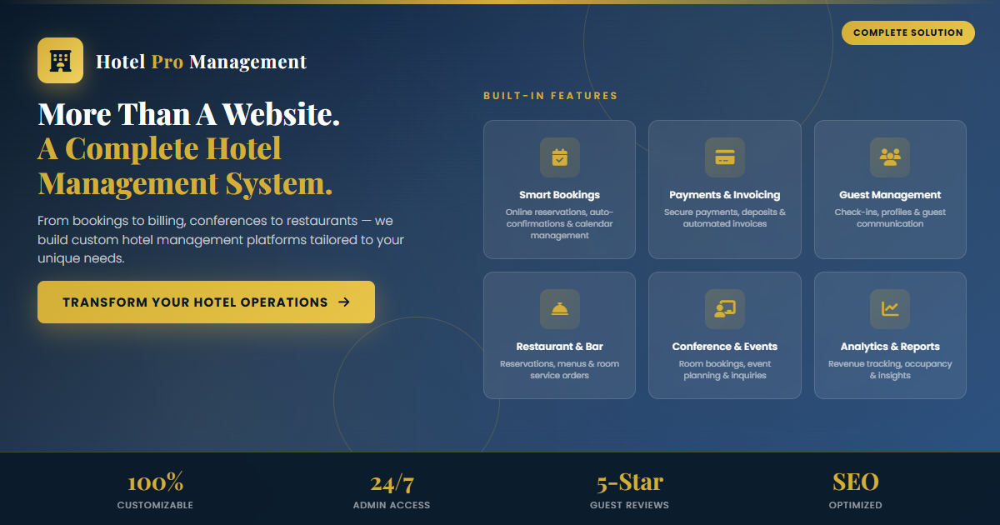

# Liwonde Sun Hotel 2026
## Complete Website + Admin Documentation (Client Version)

Prepared for: Liwonde Sun Hotel
Project: Full hotel website with integrated booking, operations, and management system

---

## 1. Executive Summary

This platform is not only a marketing website. It is a full hospitality operations system that includes:

- Public-facing hotel website pages
- Real-time booking and availability handling
- Conference, events, restaurant, and gym modules
- Full admin control panel for operations and content management
- Payment, invoice, reporting, and analytics tooling
- Security hardening (CSRF validation, authentication, role controls)

The website supports both guest engagement and internal management in one connected system.

---

## 2. Public Website Scope

### Core public pages

- `index.php` - Home page and landing content
- `room.php` - Room details and room-specific content
- `rooms-gallery.php` - Room gallery browsing
- `rooms-showcase.php` - Room showcase and highlights
- `booking.php` - Main booking form
- `check-availability.php` - Availability checks
- `booking-confirmation.php` - Booking confirmation screen
- `booking-lookup.php` - Guest booking lookup
- `conference.php` - Conference services page
- `events.php` - Events information page
- `restaurant.php` - Restaurant page
- `gym.php` - Gym page
- `menu-pdf.php` - Menu display/download endpoint
- `privacy-policy.php` - Privacy policy
- `submit-review.php` and `review-confirmation.php` - Guest review flow

### Shared public components

- `includes/header.php` and `includes/footer.php`
- `includes/hero.php`
- `includes/hotel-gallery.php`
- `includes/reviews-section.php` and `includes/reviews-display.php`
- `includes/cookie-consent.php`
- `js/main.js`
- `css/style.css`, `css/header.css`, `css/footer.css`

---

## 3. Booking and Reservation Engine

### Booking flow

1. Guest browses room options.
2. Guest checks availability.
3. Guest submits booking request.
4. Booking is saved and available in admin for processing/check-in.
5. Booking confirmations and lookup functions allow guest follow-up.

### Related endpoints and logic

- `api/availability.php`
- `api/bookings.php`
- `api/booking-details.php`
- `api/rooms.php`
- `admin/create-booking.php`
- `admin/edit-booking.php`
- `admin/process-checkin.php`
- `admin/blocked-dates.php`
- `admin/tentative-bookings.php`

---

## 4. Admin System (Full Back Office)

Admin entry point:

- `admin/login.php`
- `admin/index.php` / `admin/dashboard.php`

### 4.1 Operations modules

- `admin/bookings.php` - booking management
- `admin/calendar.php` - schedule/calendar operations
- `admin/room-management.php` - room inventory and room setup
- `admin/maintenance.php` - maintenance tasks and room/unit-level tracking
- `admin/blocked-dates.php` - controlled room/date blocking
- `admin/process-checkin.php` - operational check-in flow

### 4.2 Revenue and finance modules

- `admin/payments.php`
- `admin/payment-add.php`
- `admin/payment-details.php`
- `admin/invoices.php`
- `admin/accounting-dashboard.php`

### 4.3 Content and guest-facing modules

- `admin/page-management.php`
- `admin/gallery-management.php`
- `admin/menu-management.php`
- `admin/section-headers-management.php`
- `admin/theme-management.php`
- `admin/video-upload-handler.php`
- `admin/events-management.php`
- `admin/conference-management.php`
- `admin/gym-management.php`
- `admin/restaurant-reservations.php`
- `admin/reviews.php`

### 4.4 People, access, and internal controls

- `admin/user-management.php`
- `admin/employees.php`
- `admin/login.php`, `admin/logout.php`
- `admin/forgot-password.php`, `admin/reset-password.php`
- `admin/activity-log.php`
- `admin/api-keys.php`

### 4.5 Insights and reporting

- `admin/reports.php`
- `admin/visitor-analytics.php`
- `api/reports-export.php` (CSV export support)

---

## 5. API Layer

Primary API endpoints used by web/admin modules:

- `api/index.php`
- `api/availability.php`
- `api/bookings.php`
- `api/booking-details.php`
- `api/rooms.php`
- `api/blocked-dates.php`
- `api/payments.php`
- `api/site-settings.php`
- `api/cookie-consent.php`
- `api/reports-export.php`

---

## 6. Security and Access Controls

The platform includes:

- CSRF protection for forms and admin actions
- Session-based authentication for admin users
- Role-aware access flow (admin/manager/receptionist patterns)
- Password reset with secure token flow
- Activity logging for sensitive admin actions

Security/config files include:

- `config/security.php`
- `admin/admin-init.php`
- `includes/page-guard.php`

---

## 7. Database and Infrastructure

### Database assets

- `Database/p601229_hotels.sql`
- `Database/migrations/`
- `admin/migrations/`

### Runtime/config

- `config/database.php`
- `config/database.local.php`
- `config/cache.php`
- `config/page-cache.php`
- `config/base-url.php`

### PHP/composer

- PHP requirement: 7.4+
- Composer package: `phpmailer/phpmailer`
- Composer file: `composer.json`

---

## 8. Key Features Delivered

### Guest experience

- Multi-page branded hotel website
- Room discovery and gallery viewing
- Booking and availability checks
- Review submission and display
- Cookie consent and policy handling

### Admin experience

- Unified dashboard and operational modules
- Booking life-cycle controls
- Payment and invoice visibility
- Content editing without code changes
- Reporting and CSV exports

### Recently enhanced operational capability

- Maintenance task management supports exact room unit selection
- Maintenance activity is logged for audit visibility
- Maintenance data is available in reporting/export workflows

---

## 9. Marketing Ad (Included)

Your marketing creatives are available and included below.

### Static ad assets

- Main static ad: `marketing-ad.png`
- Alternate static render: `marketing-ad/ad-phenomenal.png`

### Animated ad assets

- Main animated ad page: `marketing-ad.html`
- Alternate animated page: `marketing-ad/animated-ad.html`

Use either HTML file to present a live animated version of the campaign.

### Suggested ad copy (client-ready)

**Headline:**
Not Just A Website. A Management System.

**Subline:**
From luxury hotels to boutique B&Bs, we deliver complete digital platforms that power bookings, operations, and growth.

**CTA:**
Book a Demo | Launch Your Property Platform

---

## 10. Suggested Admin Usage Flow (Daily)

1. Open dashboard for occupancy and booking status.
2. Review new bookings and process check-ins.
3. Verify blocked dates and maintenance tasks.
4. Track payments and invoices.
5. Review guest feedback and manage content updates.
6. Export reports for management review.

---

## 11. Deliverables Checklist

- Complete public website pages
- Complete admin management portal
- Booking + operations + reporting workflows
- Security controls and authentication
- Marketing ad assets (static + animated)
- Database/migration structure
- API endpoints for system integrations

---

## 12. Ownership and Handover Notes

This system is structured to support ongoing hotel operations, marketing updates, and administrative control from one platform.

For future enhancements, the recommended next areas are:

- online payment gateway expansion
- automated notification workflows (email/SMS)
- advanced business intelligence dashboards

---

End of client documentation.
